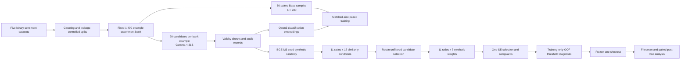

# Conditional Utility of LLM-Generated Data Augmentation in Multilingual Binary Classification

Research code accompanying the manuscript **“Conditional Utility of LLM-Generated Data Augmentation in Multilingual Binary Classification.”**

This study evaluates whether LLM-generated examples provide useful training information beyond the ordinary benefit of increasing sample size. Five binary sentiment-classification datasets spanning English, Korean, Bengali, Hausa, and Malayalam are examined under a controlled limited-data design that compares a fixed real-only Base, a matched-size all-real control, and a real-synthetic Hybrid condition.

The experiments use a common real-data base of `B = 280`, 11 augmentation ratios, 17 similarity-selection conditions, seven synthetic sample weights, and 50 paired repetitions. All dataset-specific decisions are made from development data, decision thresholds are estimated from training-only out-of-fold predictions, and the final policy is frozen before one-shot test evaluation.

The frozen policy retained synthetic augmentation for English and Bengali, preserved the real-only Base for Korean and Hausa, and reverted Malayalam to Base after decision-boundary calibration. Bengali showed clear held-out improvements in Macro-F1 and AUROC, while English showed a statistically reliable AUROC improvement without a conclusive Macro-F1 gain. In both augmented datasets, adding the same number of additional real observations remained superior to the selected Hybrid condition.

## Workflow



## Public repository structure

Only the releasable source code and this README are distributed through the public repository:

```text
Conditional-Utility-of-LLM-Generated-Data-in-Multilingual-Binary-Classification/
├─ Sources/
│  ├─ BinaryMatchedSizeExperiment/   # Generation, embeddings, paired experiments, policy freeze, and test analysis
│  ├─ Common/                        # Shared LM Studio request and model-management utilities
│  ├─ Data/                          # Dataset preparation and fixed experiment-bank construction
│  ├─ Figures/                       # Manuscript figure-generation scripts
│  └─ Pilot/                         # Generation-prompt pilot and validation
├─ .gitignore
└─ README.md
```

`Sources/Data/` contains the preprocessing and manifest-building code used to create cleaned train/development/test splits, fixed experiment banks, paired repetition records, and nested matched-size sampling plans.

`Sources/Pilot/` contains the binary-generation pilot used to validate prompting and output constraints before the main candidate-generation stage.

`Sources/BinaryMatchedSizeExperiment/` contains the main experimental pipeline, including synthetic candidate generation, Qwen3 and BGE-M3 embedding, matched-size development experiments, synthetic-weight search, conservative policy freezing, decision-boundary diagnostics, frozen one-shot test evaluation, and rank-based statistical analysis.

`Sources/Figures/` contains scripts used to generate the manuscript figures from preserved result tables.

The repository does not contain the complete `Data/` or `Results/` trees. Raw third-party datasets, prepared local copies, generated candidate text, embedding arrays, SQLite state files, lock files, and preserved experimental outputs are intentionally excluded from version control.

## Local data layout

The released scripts expect the complete local research tree beneath the repository root. The exact contents are produced incrementally by the preparation and experiment scripts.

```text
Conditional-Utility-of-LLM-Generated-Data-in-Multilingual-Binary-Classification/
├─ Sources/
├─ README.md
├─ Data/                                      # Local-only; excluded from Git
│  ├─ Raw/                                    # Original third-party datasets
│  ├─ Prepared/                               # Cleaned train/dev/test CSV files
│  └─ ExperimentManifests/
│     └─ v1/                                  # Experiment banks, repetitions, and protocol manifests
├─ Results/                                   # Local-only; excluded from Git
│  └─ BinaryMatchedSizeExperiment/
│     ├─ Pilot/
│     ├─ Generation/
│     ├─ Embeddings/
│     │  ├─ Qwen3/
│     │  ├─ BGE_M3/
│     │  └─ Qwen3Eval/
│     └─ Downstream/
│        ├─ DevelopmentGrid/
│        ├─ SyntheticWeightGrid/
│        └─ AdaptivePolicy/
└─ Figures/                                   # Rendered manuscript figures
```

The `Data/` and `Results/` directories are excluded through `.gitignore`. Users must obtain the original datasets from their respective providers and place them in the paths expected by `Sources/Data/prepare_datasets.py`.

## Datasets

The study uses five human-annotated binary sentiment datasets. All labels are normalized to `0 = negative` and `1 = positive`.

| Dataset | Language | Resource class | Train | Development | Test |
|---|---:|---:|---:|---:|---:|
| SST-2 | English | 5 | 56,927 | 10,046 | 872 |
| NSMC | Korean | 4 | 123,517 | 21,798 | 49,007 |
| CineXDrama | Bengali | 3 | 5,480 | 1,174 | 1,175 |
| HausaMovieReview | Hausa | 2 | 1,418 | 304 | 305 |
| DravidianCodeMix | Malayalam | 1 | 8,079 | 1,028 | 1,033 |

The resource classes follow the historical language-resource mapping used in the manuscript and are descriptive only. They are not treated as an independently manipulated causal variable.

The common preprocessing procedure applies Unicode NFC normalization, whitespace normalization, missing-value removal, exact text-label deduplication, conflicting-label removal, and cross-split leakage checks. Existing labeled holdout partitions are retained where available; newly created splits use the fixed seed `20260713`.

## Experimental design

A fixed experiment bank of 1,400 real examples is constructed independently for each dataset. Within each of 50 paired repetitions, `B = 280` examples form the Base subset and the remaining 1,120 examples form a non-overlapping additional-real pool.

The three principal training conditions are:

```text
Base                  = B real examples
Matched All-real(r)   = B real examples + rB additional real examples
Hybrid(r)             = B real examples + rB synthetic examples
```

The augmentation ratios are:

```text
0.5, 0.75, 1.0, 1.25, 1.5, 1.75, 2.0, 2.5, 3.0, 3.5, 4.0
```

Matched All-real and Hybrid use the same Base observations, total training size, and class composition within each paired repetition.

For every one of the 1,400 bank examples, 20 independent generation requests are issued, yielding 28,000 requests per dataset and 140,000 requests overall. Synthetic labels are inherited from their real seeds rather than assigned by the generator.

The development pipeline evaluates:

- unfiltered selection and 16 BGE-M3 seed-synthetic cosine-similarity intervals;
- seven synthetic sample weights: `0`, `1/16`, `1/8`, `1/4`, `1/2`, `3/4`, and `1`;
- L2-regularized logistic regression with `C = 1.0`;
- Macro-F1 at a `0.5` threshold and AUROC from positive-class probabilities; and
- 50 paired repetitions with seeds `1000` through `1049`.

Because no shared similarity interval consistently improved performance and restrictive intervals reduced candidate feasibility, the unfiltered condition is retained for the ratio-weight policy search.

## Models and representations

Synthetic candidates are generated locally through an LM Studio OpenAI-compatible endpoint using the instruction-tuned Gemma 4 31B model.

The frozen generation configuration is:

```text
temperature:       0.8
top_p:             0.9
repetition penalty: 1.0
maximum tokens:    256
thinking:          enabled
```

Two separate embedding models are used:

- **Qwen3-Embedding-8B** produces 4,096-dimensional L2-normalized classifier features.
- **BGE-M3** produces 1,024-dimensional L2-normalized representations used only for seed-synthetic cosine similarity.

The code defaults to the following local LM Studio endpoints:

```text
Chat completions:  http://127.0.0.1:1234/v1/chat/completions
Embeddings:        http://127.0.0.1:1234/v1/embeddings
```

Alternative API URLs, model identifiers, and concurrency values can be supplied through the command-line endpoint options exposed by the generation and embedding scripts.

## Frozen policy and reported test effects

The development-stage policy uses the one-standard-error rule and minimizes effective synthetic exposure `r x w`. Positive-weight candidates must additionally pass paired-bootstrap, neighboring-condition stability, AUROC non-inferiority, and training-only decision-boundary safeguards.

| Dataset | Frozen policy | r | w | ΔMacro-F1 at OOF threshold | ΔAUROC |
|---|---|---:|---:|---:|---:|
| English | Selected Hybrid | 3.0 | 0.75 | +0.0008 `[-0.0011, 0.0028]` | +0.0007 `[0.0006, 0.0009]` |
| Korean | Base | 0 | 0 | 0 | 0 |
| Bengali | Selected Hybrid | 4.0 | 0.50 | +0.0056 `[0.0036, 0.0076]` | +0.0022 `[0.0017, 0.0027]` |
| Hausa | Base | 0 | 0 | 0 | 0 |
| Malayalam | Base | 0 | 0 | 0 | 0 |

Values are mean paired differences from Base across 50 repetitions, with 95% paired-bootstrap confidence intervals based on 10,000 resamples.

The final Friedman and Holm-adjusted paired post-hoc analyses support a significant Selected Hybrid improvement for Bengali in both Macro-F1 and AUROC and for English in AUROC. Matched All-real significantly exceeds Selected Hybrid in both metrics for both augmented datasets.

## Running the code

A typical fresh run follows this stage order:

1. acquire the original datasets under `Data/Raw/`;
2. run `Sources/Data/prepare_datasets.py`;
3. run `Sources/Data/build_experiment_manifest.py`;
4. validate prompting with `Sources/Pilot/binary_pilot.py`;
5. generate candidates and create Qwen3/BGE-M3 embeddings;
6. run the matched-size development grid;
7. summarize the development results and run the synthetic-weight grid;
8. freeze the adaptive protocol and perform the training-only decision-boundary diagnostic;
9. run the frozen one-shot test;
10. run the Friedman and paired post-hoc analysis; and
11. generate the manuscript figures from the preserved result tables.

The main orchestration and stage-specific scripts expose command-line help:

```bash
python Sources/BinaryMatchedSizeExperiment/run_binary_matched_size_experiment.py --help
python Sources/BinaryMatchedSizeExperiment/run_binary_downstream_experiment.py --help
python Sources/BinaryMatchedSizeExperiment/run_binary_synthetic_weight_grid.py --help
python Sources/BinaryMatchedSizeExperiment/run_binary_decision_boundary_diagnostic.py --help
python Sources/BinaryMatchedSizeExperiment/run_binary_adaptive_one_shot_test.py --help
```

Stage outputs are protected by manifests and lock files. Later stages should be run only after the required preceding outputs have been completed and validated.

## Reproducibility scope

The public repository supports inspection and rerunning of the released procedures for:

- dataset cleaning, label normalization, splitting, and leakage checks;
- fixed experiment-bank and paired repetition construction;
- local LLM candidate generation and output validation;
- downstream and similarity embedding;
- matched-size Base, Matched All-real, and Hybrid comparisons;
- augmentation-ratio and synthetic-weight searches;
- conservative development-stage policy selection;
- training-only out-of-fold threshold estimation;
- frozen one-shot test evaluation;
- paired bootstrap confidence intervals;
- Friedman omnibus tests and Holm-adjusted paired Wilcoxon tests; and
- manuscript figure generation.

Exact reproduction is not possible from the repository alone because the original third-party datasets, generated candidate pool, model files, embedding arrays, and preserved result artifacts are not distributed. A fresh reproduction additionally depends on access to compatible versions of the named language and embedding models.

## Environment

A recent Python 3 environment is recommended. The released scripts use packages including:

```text
numpy
pandas
pyarrow
scipy
scikit-learn
matplotlib
torch
transformers
```

Example setup:

```bash
python -m venv .venv

# Linux or macOS
source .venv/bin/activate

# Windows PowerShell
.venv\Scripts\Activate.ps1

python -m pip install --upgrade pip
python -m pip install numpy pandas pyarrow scipy scikit-learn matplotlib torch transformers
```

LM Studio must be installed and configured separately with the generation and embedding models required by the selected stage.

## Data availability

The original datasets are third-party research resources and are not redistributed through this repository. The manuscript states that the datasets used and/or analyzed during the study are available from the corresponding author on reasonable request.

Generated candidates, embeddings, manifests, and preserved outputs are also excluded from the public repository because of their size. They may be supplied separately for confidential editorial or peer-review verification when appropriate and subject to the original dataset and model licenses.

## Research-use notice

This repository is provided for research, methodological inspection, and reproducibility work. Users are responsible for complying with the licenses and terms of the original datasets, language models, embedding models, and local inference software.

## Citation

Please cite the associated manuscript when using or discussing this code:

> Jungyeol Ko, Haseung Ryu, and Seongil Han. “Conditional Utility of LLM-Generated Data Augmentation in Multilingual Binary Classification.”

Full bibliographic information will be added after publication.
